# 🌾 AgroChain - Complete Process Flowchart

## Overview
This document provides a comprehensive flowchart of the AgroChain blockchain-based agricultural supply chain transparency system.

---

## 🏗️ System Architecture Flow

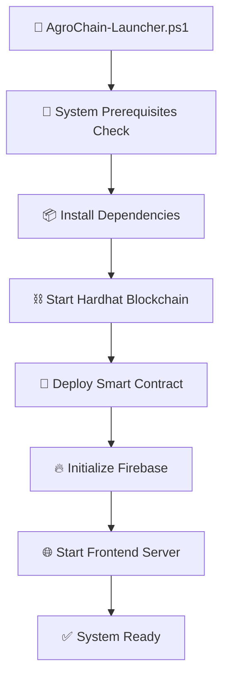

---

## 🔄 Complete Supply Chain Flow

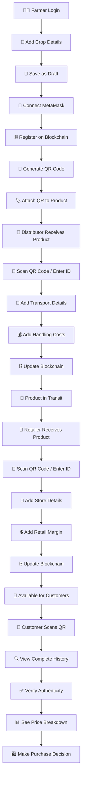

---

## 🎯 User Role Workflows

### 👨‍🌾 Farmer Workflow

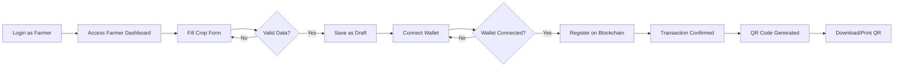

### 🚛 Distributor Workflow

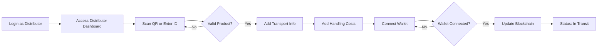

### 🏪 Retailer Workflow

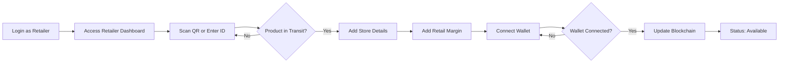

### 👥 Customer Workflow

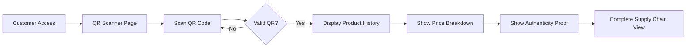

---

## 🔧 Technical Architecture

### Frontend Structure
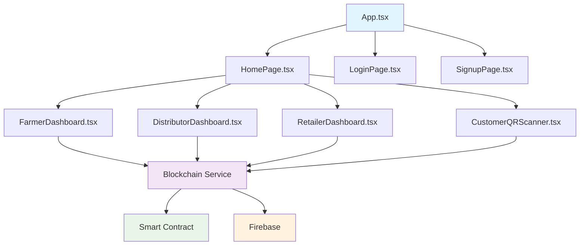

### Services Integration
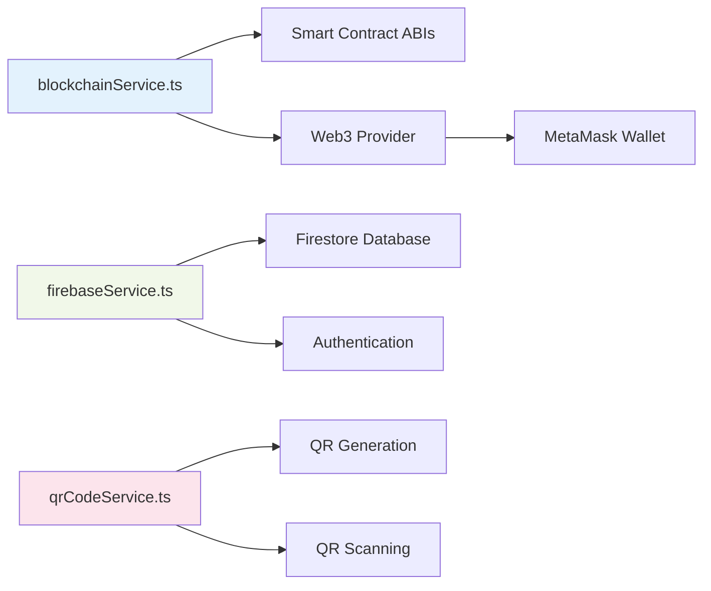

---

## 📱 QR Code Integration Flow

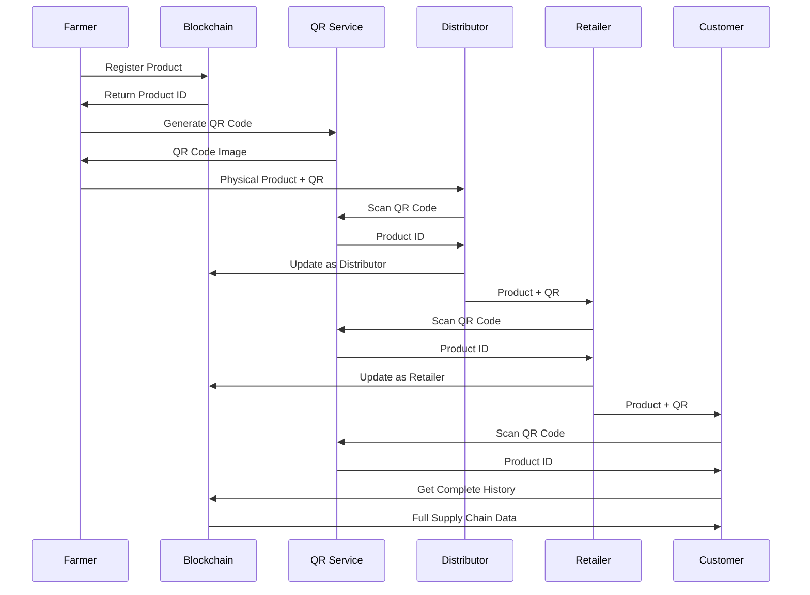

---

## 🔐 Blockchain Integration Flow

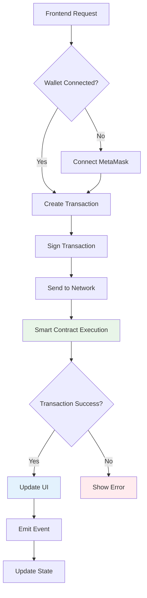

---

## 📊 Data Flow Architecture

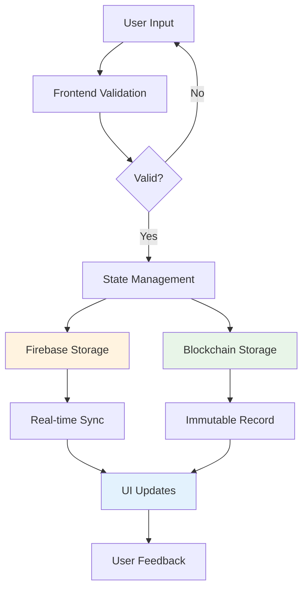

---

## 🚀 Deployment & Launch Flow

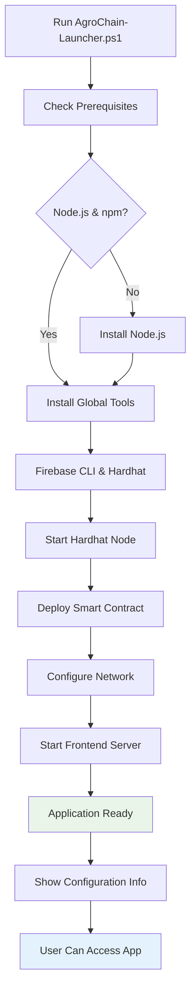

---

## 🔄 Error Handling Flow

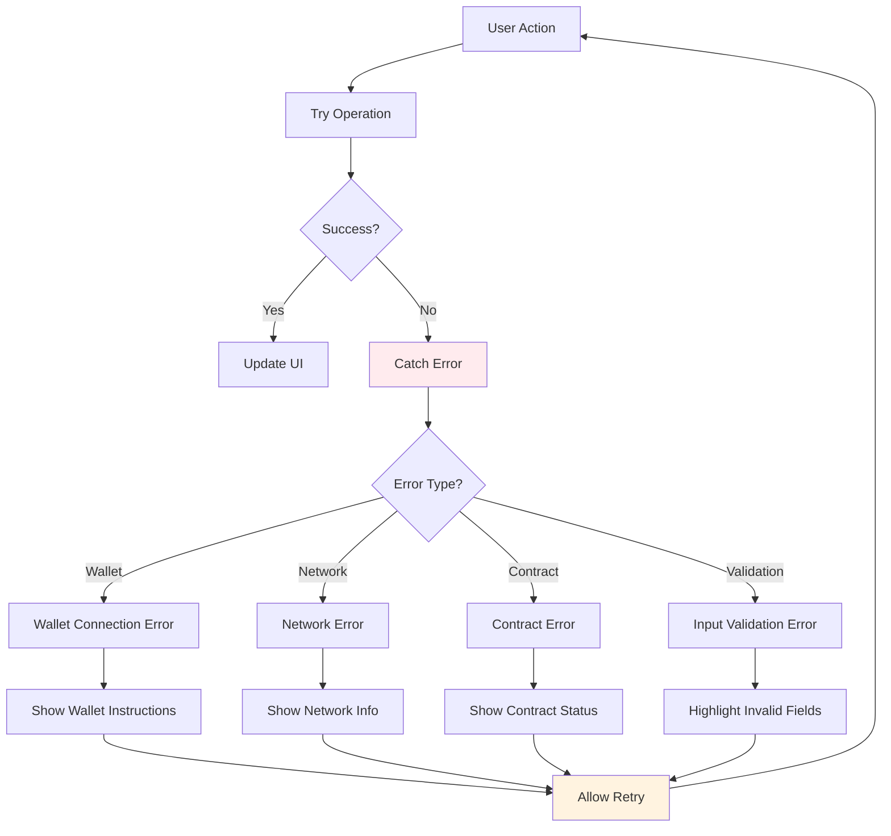

---

## 📈 Performance & Monitoring Flow

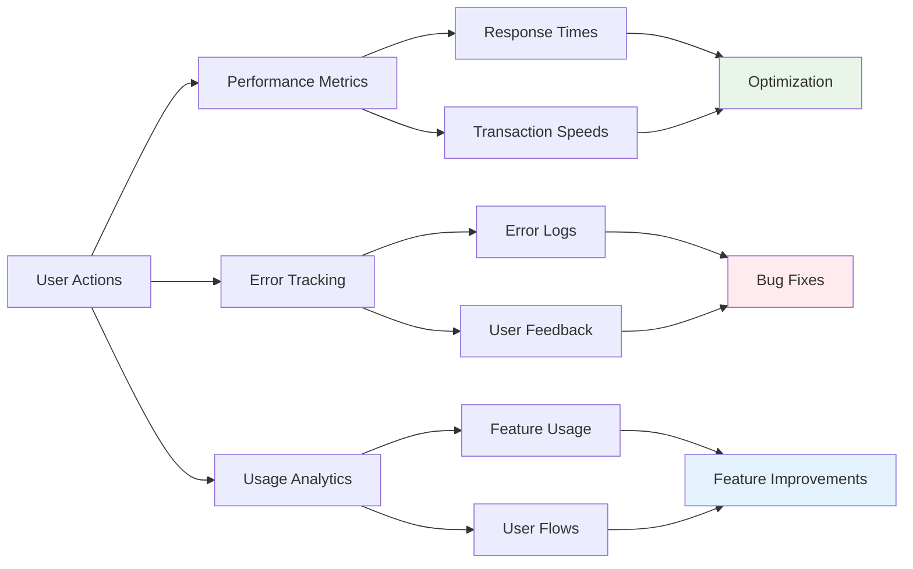

---

## 🎯 Success Metrics Flow

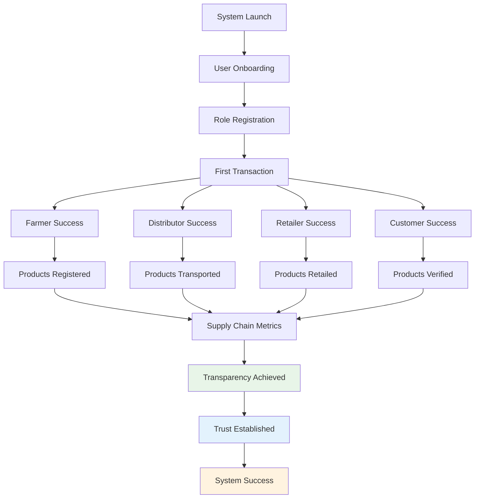

---

## 🔧 Development Workflow

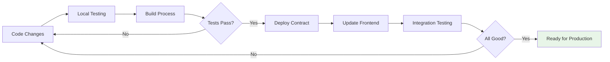

---

This flowchart provides a complete overview of the AgroChain system, from technical architecture to user workflows and deployment processes. Each section can be referenced for understanding specific aspects of the application flow.
